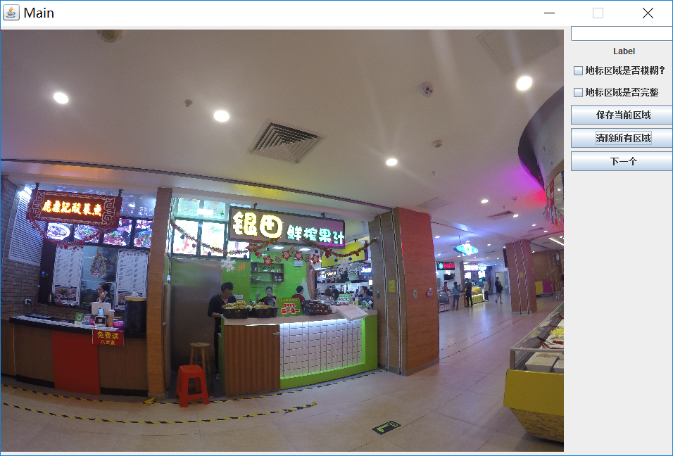
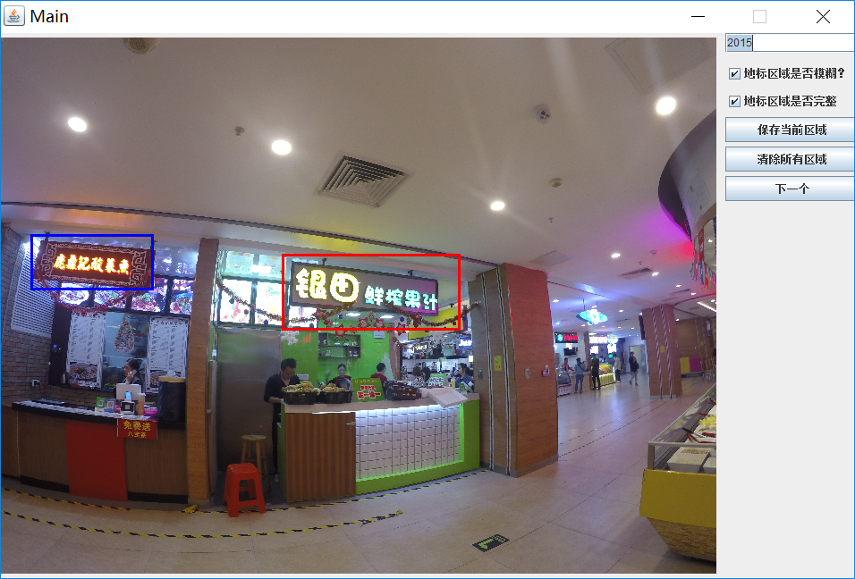

## 照片标注程序使用说明

> Created By Mingkuan At 2017-04-17

- *可以直接执行系统脚本的方式运行程序**

```shell
#shell 打开照片标注程序
#参数分别代表：图片文件夹 输出文件夹 地标label文件 fast-rcnn的标注结果
java -jar TagTools.jar samples/image samples/output samples/landmark_list.txt samples/reference

#C++调用系统命令
system(command)

#Java调用系统命令
Process process = Runtime.getRuntime.exec(command);
process.waitFor();
```



- 其中三个参数的含义分别是：

| parameters |          samples          |   meanings   |
| :--------: | :-----------------------: | :----------: |
|   arg[0]   |     samples/image         |   图片文件夹   |
|   arg[1]   |    samples/output         |   输出文件夹   |
|   arg[2]   | samples/landmark_list.txt | 店铺序号与名字对应的列表 |
|   arg[3]   |      samples/reference    |  fast-rcnn的标注结果 |

- imageList.txt内有两列，第一列为图片文件夹下所有图片的名称，第二列标记了该图片是否已标注，0-未标注，1-已标注；每次打开程序会从第一张未标注图片开始往下遍历

- 结果文件的文件名称与图片名称保持一致。
- 结果文件一共有8列，每一行代表在照片里的一个landmark，每一列的含义分别是：

```shell
#输入图片文件名 #左上角坐标x y #右下角的坐标x y #该区域对应的店铺编号 #该区域是否模糊 #该区域是否完整
GOPR0742.JPG 219 1134 779 1384 2 0 0
GOPR0742.JPG 1614 1259 2484 1554 3 0 1
GOPR0742.JPG 3089 1639 3234 1714 4 1 0
```

- 店铺序号与名字对应的列表一共有两列，每一行代表一个店铺，第一列代表店铺编号，第二列表示店铺的名字，这个列表为了方便在标注的时候确定对应的矩形区域是属于哪个店铺的

#### 标注过程

1. 在左侧图片上通过鼠标框出店铺Landmark区域，如果Landmark已经存在现有的数据库中，右侧的输入框会自动显示该Landmark对应的id，否则需要对照landmark_list.txt找到Landmark并输入Landmark的id，或者输入“-1”表示Landmark不存在于数据库，再手动选择Landmark区域“是否模糊”和“是否完整”，然后点击“保存当前区域”按钮，保存当前的矩形区域，保存后矩形区域由红色变成蓝色；
2. 如果标注错误，点击“清空所有区域”按钮，清空当前图片上的所有Landmark区域；
3. 标注完当前图片的区域后，点击"下一个"按钮，保存标注信息到输出文件并显示下一张图片；

注意：

- 需要点击“下一个”按钮才会保存当前图片的标注信息，下次运行程序会从第一张未标注的图片开始；
- 一张图中可能存在多个Landmark，每次框出Landmark区域后都要点击一次“保存当前区域”的按钮；



# TagTool
